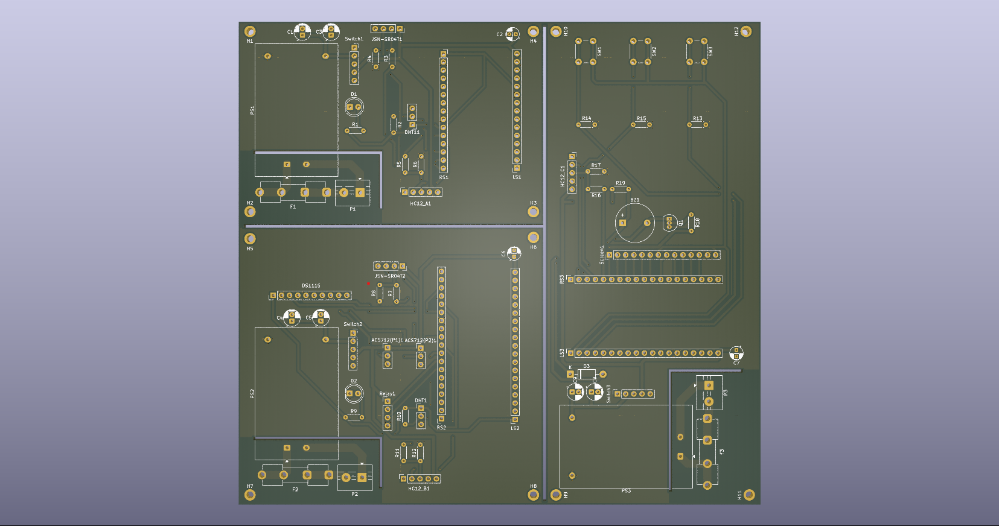

# HydroLogix: Custom Water Automation Ecosystem 
> **Engineering Philosophy:** Anticipate every failure point. Mitigate before fabrication.

## 🚀 The Stack
This project represents a full-stack hardware and software ecosystem built from the ground up for industrial-grade water management.

* **HydroLogix OS:** A custom-built Real-Time Operating System designed for deterministic task execution and hardware-level safety interrupts.
* **WACPv4.0 (Water Automation Control Protocol):** A proprietary communication protocol developed specifically for this system.
* **Pocket UI:** The dedicated system interface (UIOS) designed for mobile-friendly monitoring and manual override.

---

## 📐 Hardware Evolution & Engineering
### The "All-in-One" Board Strategy
To optimize for both signal integrity and manufacturing budget, the hardware design has transitioned to a consolidated **Master Board**.

* **Panelized Design:** Sub-circuits are laid out on a single PCB, ready to be cut post-fabrication.
* **Ground Plane Implementation:** A dedicated ground plane has been integrated to shield the **WACPv4.0** data lines from EMI generated by high-voltage pumps.

---

## 💧 The Mission: Smart Resource Orchestration
This system was developed to solve the "Open-Loop" problem in residential/commercial water management—where manual monitoring leads to pump burnout (dry-running) or water wastage (overflow).

### How it Works:
1. **Orchestration:** The Master Unit (Pocket UI) communicates with the **Sump Station** and **Overhead Station** via WACPv4.0.
2. **Autonomous Logic:** Using a distributed State Machine, the system monitors reservoir levels. If the Overhead Tank is low AND the Sump has sufficient water, the **HydroLogix OS** triggers the pump.
3. **Safety Interlocks:** The system performs real-time current analysis. If a "Stalled Rotor" or "Dry Run" is detected via amperage spikes/drops, the system executes a sub-millisecond hardware halt to protect the motor.

---

## 🎨 Assets & Visualizations
A deep dive into the physical design and validation stages.

### 1. Circuit Design & Analysis
* [**PCB Schematics (PDF)**](./Assets/PCB_Schematic.pdf)
* [**PCB Editor View (PDF)**](./Assets/PCB_Editor.pdf)

### 2. 3D Render
This render shows the anticipated final form of the consolidated Master Board.

### 3. Physical Prototyping (Phase: SC1)
Validation on the bench before finalizing PCB trace routing.

| **Prototype: Front View** | **Prototype: Back View** |
| :---: | :---: |
|  |  |
| *Validation of component interface.* | *Point-to-point wiring validation.* |

---

## 📂 System Documentation
* [**Design Overview**](./Design%20overview.pdf)
* [**System Architecture**](./System%20Architecture.pdf)
* [**Communication Protocol & OS**](./Communication%20Protocol%20&%20OS.pdf)
* [**Performance Analysis**](./Performance%20Analysis.pdf)

---
*Developed by Sambridda*
